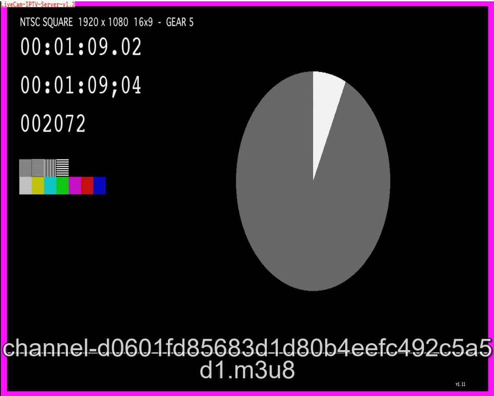

<h1>PHP IPTV Class</h1>
 
<h2>How To Use It ?</h2>

First of all, you must be edit "conf.json" file about your URL and your FFMPeg parameters and you can run with HTTP PHP Server

<h2>About</h2>
<b>This system tested on Windows 8, Ubuntu, CentOS and Windows Server 2012</b>
  
<b>ÖNEMLİ NOT :  Bu sistem sadece eğitim amaçlı üretilmiş olup herkesin kullanımına açık bir programdır. Bu program üzerinden işlenecek herhangi bir yasa dışı aktiviteden sorumluluk kabul etmemekteyiz.  Bunu göze alarak indirmenizi önemle rica ederiz.</pre>
  
 
 
 
 
 
